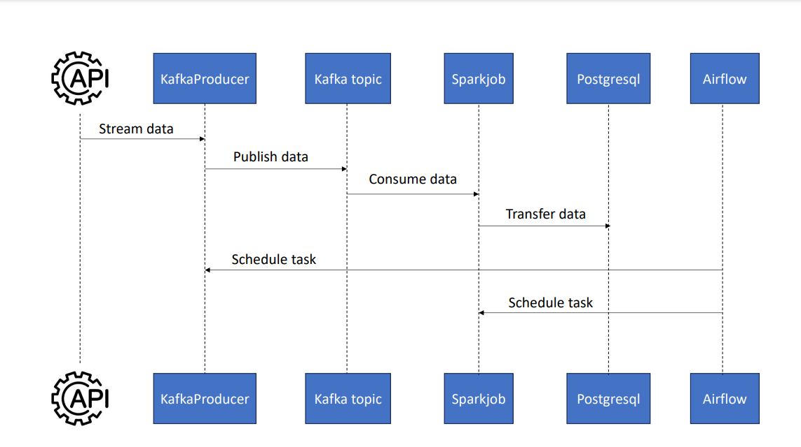

# Data-engineer-Porojet

1. Streaming de données : dans un premier temps, les données sont diffusées depuis l’API vers une rubrique Kafka.
2. Traitement des données : une tâche Spark prend ensuite le relais, consommant les données de la rubrique Kafka et les transférant vers une base de données PostgreSQL.
3. Planification avec Airflow : la tâche de streaming et la tâche Spark sont toutes deux orchestrées à l’aide d’Airflow. Alors que dans un scénario réel, le producteur Kafka écouterait constamment l’API, à des fins de démonstration, nous allons planifier l’exécution quotidienne de la tâche de streaming Kafka. Une fois le streaming terminé, la tâche Spark traite les données, les rendant prêtes à être utilisées par l’application LLM.

Tous ces outils seront créés et exécutés à l’aide de Docker, et plus précisément de [docker-compose](https://docs.docker.com/compose/).

* Le répertoire airflow contient un Dockerfile personnalisé pour configurer airflow et un répertoire dags pour créer et planifier les tâches.
* Le répertoire data contient le fichier last_processed.json qui est crucial pour la tâche de streaming Kafka. De plus amples détails sur son rôle seront fournis dans la section Kafka.
* Le fichier docker-compose-airflow.yaml définit tous les services requis pour exécuter airflow.
* Le fichier docker-compose.yaml spécifie les services Kafka et inclut un docker-proxy. Ce proxy est essentiel pour exécuter des tâches Spark via un docker-operator dans Airflow, un concept qui sera développé plus tard.
* Le répertoire spark contient un Dockerfile personnalisé pour la configuration de spark.
* src contient les modules python nécessaires à l'exécution de l'application.
